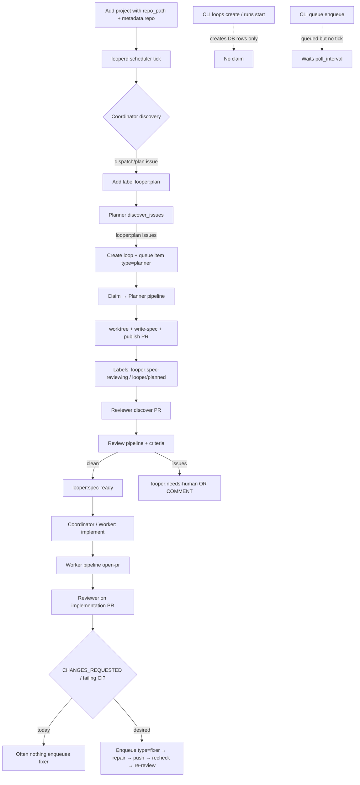
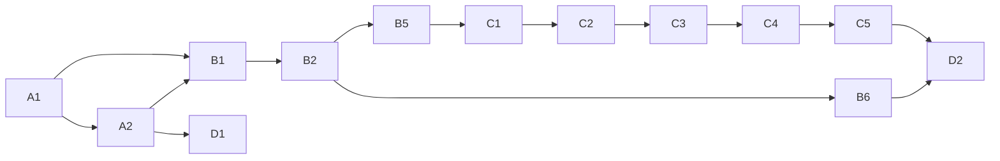

# Rust-Native Gap Closure Plan

> **Scope:** Close product integrity, golden-path, and loop-convergence gaps in `looper_rust`.
> **Constraint:** Rust-native design. Go (`/tmp/looper-go-ref`) is a *behavioral reference for planner/reviewer/fixer/worker convergence only* — not a port checklist.
> **Date:** 2026-07-11
> **Source of truth:** current crate code under `crates/`, not PORTING specs or README aspirational docs.

---

## 1. Executive summary

### Where we are honestly

`looper_rust` already has a real daemon spine:

- `looperd` wires **Planner / Reviewer / Fixer / Worker / Coordinator** into `looper-scheduler` and serves a nested axum API under `/api/projects/{name}/...`.
- Label-driven discovery exists: `looper:plan` → planner, coordinator dispatch labels, spec-phase labels (`looper:spec-reviewing` / `looper:spec-ready`), reviewer publish + criteria checks, worker implement + open-pr.
- Storage, domain types, agent executor, git/github gateways, and e2e harness scaffolding are present and useful.

But the **user-facing surface is dishonest in places**, the **manual start path does not feed the scheduler**, and **reviewer↔fixer convergence is incomplete** for real PR iteration. Several CLI commands claim success while only calling `/health` or printing hardcoded JSON. Default CLI port (`8080`) does not match daemon default (`7391`). README documents Go-shaped UX that the Rust CLI does not implement.

### What “done” means for this phase (testable)

1. **No false success:** every CLI subcommand either does real work, returns an explicit “not supported” error, or is removed/hidden.
2. **One real start-work path per role** that creates loop + queue item and is claimed by the scheduler (CLI or API — shape can be Rust-native).
3. **Convergence loop works:** when review finds issues or CI fails, a fixer item is enqueued, runs repair with agent wait, pushes, and re-triggers review/CI path; failure/retry/pause are observable and correct.
4. **Ops honesty:** autoupgrade either downloads/swaps or is demoted to check+manual; e2e and CLI talk to the real daemon contract; diagnostics report real daemon state.
5. **Tests prove the above** without relying on stub `print_ok` messages.

Out of scope for “done”: Forgejo, Plane, HITL, Feishu, interactive takeover sessions, Go API path parity, LOC parity.

---

## 2. Principles

### Rust-native rules

| Do | Don't |
|----|-------|
| Prefer deleting/hiding fake UX over shipping more stubs | Port Go `/api/v1/*` routes “for parity” |
| Keep nested project-scoped axum routes | Clone Go package layout or command names blindly |
| Drive work via **queue items + scheduler claim** | Create “pending” runs that never get claimed |
| Reuse `looper-service` domain rules where they exist | Bypass service layer with ad-hoc route upserts |
| Use Go only for *behavior* inspiration (labels, step order, failure classes) | Copy Go modules (HITL, Forgejo, Feishu, notify-webhook) just because they exist |
| Prefer explicit CLI surface that matches shipped reality | Document aspirational Go UX in README as if it worked |

### Preserve (unless change is justified)

- Crate boundaries: `types → config/storage → service → github/git/agent → scheduler → runner → api/infra → bins`
- API shape: `/health`, `/version`, `/api/projects/{name}/loops|runs|queue|events|...`
- Envelope `{ ok, data, error }`
- Scheduler tick + claim model in `looper-scheduler`
- Label authority for eligibility (`looper:plan`, `looper:spec-*`, `dispatch/*`)
- Multi-vendor agent executor (`looper-agent`)

### Non-goals (explicit)

- No 1:1 Go API or CLI command parity
- No multi-forge / Plane / HITL / Feishu
- No chasing Go LOC or package count
- No expanding network/webhook CLI until product prioritizes multi-node

---

## 3. Current state map

### 3.1 CLI inventory

**Legend:** **Real** = calls daemon/filesystem and reflects real state · **Partial** = real calls but incomplete semantics · **Stub/Fake** = success without work · **Hide** = recommend remove or gate behind experimental flag

| Command | Status | Evidence |
|---------|--------|----------|
| `health` | Real | `main.rs` → `client.health()` → `GET /health` |
| `version` | Real | `GET /version` |
| `shutdown` / `reload` | Partial | shutdown works; reload API is placeholder (`routes.rs` “config reload is a placeholder”) |
| `projects list/add/get/remove` | Real | client + API project routes |
| `projects sync` | Partial | `DaemonProjectService::sync` only re-reads DB, no discovery |
| `loops *` | Partial | create/list/pause/resume/terminate work on DB; create does **not** enqueue work |
| `runs *` | Partial | start creates `pending` run record only — **no queue item, no tick** |
| `queue list/enqueue/dequeue` | Partial | enqueue works; dequeue cancels **all** project items then one complete (`routes.rs` `dequeue`) |
| `events list` | Real | list events |
| `locks *` | Partial | acquire/release work; list returns **expired** locks only (`list_expired`) |
| `config get` / `config agent` | Partial | get works; agent path client `/api/config/agent/{p}` ≠ server `/api/projects/{name}/agent-config` |
| `config-local *` | Real | local TOML file ops |
| `daemon *` | Real | process start/stop/install; install download uses `quangdang46/looper` |
| `autoupgrade check/status` | Partial | check hits **wrong repo** `looper-ai/looper`; status reads state file |
| `autoupgrade upgrade` | Stub | `perform_download_and_swap` returns “not yet implemented” |
| `review submit/status` | Stub/Fake | `print_ok` only (`commands/review.rs`) |
| `takeover claim/release/status` | Stub/Fake | hardcoded JSON, ignores client (`commands/takeover.rs`) |
| `run-stats *` | Stub/Fake | placeholder text (`commands/run_stats.rs`) |
| `logs-follow` | Stub/Fake | only `health()` |
| `netadmin` / `labels` / `prompt` / `feedback` / `webhook` / `diagnostics` | Stub/Fake | only `health()` |
| `worktree cleanup` | Real | `POST /api/worktree/cleanup` |
| `ps` | Partial | lists loops with status active/running only |
| `stop` | Real | terminate via project resolve |
| `jump` | Partial | reads `metadata.worktree_path` which is often unset → “(not available via API)” |
| `pr list` | Partial | lists **active loops**, not GitHub PRs |
| `pr show/status` | Real | shells out to `gh` (hardcoded default repo `quangdang46/test-looper`) |
| `bootstrap` | Real | preflight checks (gh/git/agents/daemon) |
| `reconcile-stale` | Stub/misnamed | **terminates all active loops** — not stale-run recovery |

**Default URL bug (P0 UX):** CLI defaults `--daemon-url http://127.0.0.1:8080` (`main.rs`, `commands/mod.rs`) while `looperd` defaults port **7391** (`looperd/main.rs`, `configs/looper.toml`, `looper-config` defaults).

**Docs skew:** `README.md` CLI section documents `looper status`, `looper run <issue-url>`, `looper network *`, `looper inspect` etc. — **not** the clap surface in `looper-cli`.

### 3.2 API inventory vs needs

| Route group | Exists | Needed for golden path? | Gaps |
|-------------|--------|-------------------------|------|
| `/health`, `/version` | Yes | Yes | OK |
| `/shutdown`, `/reload` | Yes | Ops | reload no-op |
| `/api/projects` CRUD + sync | Yes | Yes | `update_project` does not persist; sync weak |
| `/api/projects/{n}/loops` | Yes | Yes | `create_loop` bypasses `LoopService` validation/conflict; no enqueue + no tick |
| loop pause/resume/terminate | Yes | Yes | pause → `stop_loop` (status `stopped`); resume sets `active` only (no re-queue) |
| `/loops/{seq}/runs` | Yes | Partial | `start_run` bypasses `RunService`; status `pending`; no scheduler |
| queue list/enqueue/dequeue | Yes | Yes | enqueue no tick; dequeue over-broad cancel; response `loop_seq` often wrong |
| events + SSE | Yes | Observability | SSE exists; CLI has no real follow |
| locks | Yes | Low | list wrong set |
| config + agent-config | Yes | Yes | path mismatch with CLI |
| worktree cleanup | Yes | Ops | OK |

**Important:** `RuntimeState::trigger_scheduler_tick` exists and is implemented on `DaemonState`, but **almost no API handlers call it** (only repair_reviewer path in daemon uses it). Manual enqueue/create therefore waits for the next poll interval.

### 3.3 Golden-path flow (as implemented today)

**How a user/agent starts work today (real path):**

1. Configure project in DB (`looper projects add` with path + `repo_url` so `metadata_json.repo` is set).
2. Ensure daemon running with git/gh/agent on PATH.
3. Label issue `looper:plan` (or `dispatch/plan` for coordinator).
4. Wait for scheduler tick → planner → …  
There is **no first-class CLI “start planner on issue #N”** that both creates the loop and enqueues a claimable item with tick.

### 3.4 Runner capabilities vs holes (product terms)

| Role | What works | Critical holes for convergence |
|------|------------|--------------------------------|
| **Coordinator** | Label dispatch, spec-ready → implement transition, some enqueue | Depends on correct project `repo` metadata |
| **Planner** | Discover `looper:plan`, create loop/queue, worktree, agent write-spec, publish PR, labels | Manual API create does not enter this path |
| **Reviewer** | Discover PRs, agent review, criteria extract/verify, submit review, spec label transition | Does **not** enqueue fixer on failed review / failing checks; implementation PR path is “ready for human” |
| **Worker** | Spec PR lookup, agent execute with wait, validate (cargo/node/python), open PR, mark_retry on validate fail | Relies on discovery labels; manual start incomplete |
| **Fixer** | Pipeline skeleton: collect/repair/validate/push/resolve/recheck | **Discover only lists existing fixer items** — does not create from GitHub state; repair often **starts agent without wait**; empty working_directory; push/recheck use fragile paths |
| **Lifecycle / failure** | Scheduler failure classification exists | Runners often log-and-continue instead of surfacing classified failures |

**Domain inconsistency (internal):** `looper_types::LoopType::steps()` (`discover/assess/plan/...`) does **not** match runner step constants in `looper-runner/src/types.rs` (`discover-issues`, `write-spec`, …). `RunService` validates steps against domain types — API `start_run` skips that and uses free-form step names.

### 3.5 Rust-specific advantages to preserve

- Typed workspace crates and zero-IO domain crate (`looper-types`)
- Trait-based `RuntimeState` / `ProjectService` seams for daemon injection
- `HandlerMap` + claim processor dispatch (clean role wiring)
- Envelope API + nested routes (clear ownership by project)
- E2E with fake-gh / fake-agent (good contract testing surface)
- Failure classification in `looper-scheduler` (ready to be used more by runners)
- Hermes vendor already present (Go de-emphasized this)

---

## 4. Gap catalog (ONLY real product gaps)

### G-CLI-01 — Fake / health-only CLI commands
- **Severity:** P0
- **Problem:** Users see success for takeover/review/run-stats/logs-follow/labels/prompt/feedback/webhook/netadmin/diagnostics while nothing happens.
- **Impact:** Trust destroyed; automation false positives.
- **Evidence:**
  - `crates/looper-cli/src/commands/takeover.rs` (hardcoded JSON)
  - `crates/looper-cli/src/commands/review.rs` (`print_ok`)
  - `crates/looper-cli/src/commands/run_stats.rs`
  - `crates/looper-cli/src/commands/{feedback,prompt,labels,webhook,netadmin,diagnostics,logs_follow}.rs` (only `client.health()`)
- **Success criteria:** Each command either (a) implements real behavior, (b) returns non-zero with clear “unsupported”, or (c) is removed from clap surface / hidden behind `#[command(hide = true)]` + docs.
- **Non-goals:** Full Go feature parity for each command.
- **Approach:** Prefer **hide/remove** for netadmin/labels/prompt/feedback/webhook until product needs them. For review: either wrap `gh pr review` honestly (local) or daemon endpoint that uses github gateway. For takeover: hide until product chooses interactive session model. For run-stats: implement from storage/events or hide. For diagnostics: real summary from health + projects + queue depths + scheduler uptime.
- **Crates:** `looper-cli` (± `looper-api` if review/diagnostics need data)
- **Tests:** CLI unit/integration: stub commands never return ok without error; clap help does not list hidden commands as primary UX.
- **Deps:** None

### G-CLI-02 — CLI default daemon port wrong
- **Severity:** P0
- **Problem:** Default `http://127.0.0.1:8080` vs daemon `7391`.
- **Evidence:** `looper-cli/src/main.rs` L27–28; `looperd/src/main.rs` L549; `configs/looper.toml`
- **Success criteria:** Fresh install: `looper health` talks to default daemon without flags.
- **Approach:** Default CLI URL to `http://127.0.0.1:7391`; optionally read server host/port from local config if present.
- **Crates:** `looper-cli`, docs/README
- **Tests:** unit on default constant; e2e smoke uses same default as daemon config helper
- **Deps:** None

### G-CLI-03 — Agent config path mismatch
- **Severity:** P1
- **Problem:** `GET /api/config/agent/{project}` (client) vs `GET /api/projects/{name}/agent-config` (server) → broken `looper config agent`.
- **Evidence:** `client.rs` L435–436; `server.rs` L62
- **Success criteria:** `looper config agent <project>` returns agent config envelope.
- **Approach:** Fix client to match server path (keep Rust nested shape).
- **Crates:** `looper-cli`
- **Tests:** client path constant test or API contract test
- **Deps:** None

### G-CLI-04 — `reconcile-stale` is destructive misnomer
- **Severity:** P1
- **Problem:** Terminates all active/running loops instead of recovering stale runs.
- **Evidence:** `commands/reconcile.rs`
- **Success criteria:** Either implements real stale recovery (interrupt dead runs, requeue claimable work) or is renamed/hidden with scary confirmation.
- **Approach:** Prefer hide until `agent_cleanup::interrupt_stale_runs` + queue reclaim are exposed as a deliberate API; then wire CLI to that.
- **Crates:** `looper-cli`, possibly `looper-api` + `looperd`
- **Deps:** G-API-03 optional

### G-API-01 — Manual create/start does not schedule work
- **Severity:** P0
- **Problem:** `POST .../loops` and `POST .../runs` write SQLite rows but do not create claimable queue items or trigger tick → “CLI started a run” that never executes.
- **Evidence:** `looper-api/src/routes.rs` `create_loop`, `start_run`; claim only processes queue (`looper-scheduler/src/claim.rs`)
- **Success criteria:** One documented path creates loop + queue item of correct `type` and is processed within one tick (or immediate `trigger_scheduler_tick`).
- **Non-goals:** Go-style `/api/v1/run` shape.
- **Approach (Rust-native):**
  1. Add service-level “admit work” API, e.g. `StartWorkInput { project, role, target, repo, priority }` in `looper-service` or scheduler-facing helper.
  2. API route (keep nested): `POST /api/projects/{name}/work` **or** enhance `create_loop` + `enqueue` to be transactional:
     - validate via `LoopService`
     - create loop with correct target_type/repo/pr_number
     - create queue item `type` = loop role, dedupe key, payload
     - `state.trigger_scheduler_tick()`
  3. Deprecate raw `start_run` as “record only” or make it enqueue if missing.
- **Crates:** `looper-service`, `looper-api`, `looperd`, `looper-cli`
- **Tests:** integration: enqueue → claim processor invoked (mock handler or e2e with fake-agent)
- **Deps:** G-CLI-05 (CLI wrapper)

### G-API-02 — Route handlers bypass service layer / weak mutations
- **Severity:** P1
- **Problem:** Domain rules in `LoopService` / `RunService` (conflict, step validation, one running run) are skipped; `update_project` does not persist; `dequeue` cancels entire project queue.
- **Evidence:** `routes.rs` create_loop/start_run/update_project/dequeue; contrast `looper-service/src/{loop,run}_service.rs`
- **Success criteria:** Mutations go through service methods; update_project persists; dequeue affects single item only.
- **Approach:** Thin handlers → service methods; add `ProjectService::patch` or storage update; fix dequeue to `cancel`/`complete` by id only.
- **Crates:** `looper-api`, `looper-service`, `looper-storage` if needed
- **Tests:** service already has unit tests — wire API integration tests for conflict and single dequeue
- **Deps:** G-API-01 shares create path

### G-API-03 — Enqueue does not trigger scheduler tick
- **Severity:** P1
- **Problem:** Manual queue items wait for poll interval.
- **Evidence:** `enqueue` in `routes.rs`; `trigger_scheduler_tick` unused by handlers
- **Success criteria:** After enqueue (and start-work), tick fires promptly.
- **Approach:** Call `state.trigger_scheduler_tick()` after successful enqueue/create-work/repair_reviewer (already does for repair).
- **Crates:** `looper-api`
- **Tests:** unit with mock RuntimeState counting tick calls
- **Deps:** None

### G-API-04 — Locks list returns expired set
- **Severity:** P2
- **Problem:** Misleading lock inventory.
- **Evidence:** `list_locks` uses `list_expired`; storage only has `list_expired`
- **Success criteria:** List active locks (expires_at > now).
- **Approach:** Add `LocksRepository::list_active(now)` and use it.
- **Crates:** `looper-storage`, `looper-api`
- **Deps:** None

### G-GOLD-01 — No first-class start-work CLI
- **Severity:** P0
- **Problem:** Operators cannot cleanly say “plan this issue” / “review this PR” / “fix this PR” without hand-crafting loops+queue types.
- **Evidence:** CLI has `loops create` + `runs start` + `queue enqueue` but no cohesive command; README promises `looper run <issue-url>` which does not exist.
- **Success criteria:** At least one of:
  - `looper work start --project P --role planner --issue 12`
  - or `looper loops create --type planner --target 12 --enqueue` that fully admits work
  Documented in README to match reality.
- **Non-goals:** Port Go command names.
- **Approach:** Thin CLI over G-API-01. Infer repo from project metadata. Optional: accept GitHub URL parse.
- **Crates:** `looper-cli`, docs
- **Tests:** CLI parse + e2e admit work with fake-gh
- **Deps:** G-API-01, G-CLI-02

### G-RUN-01 — Reviewer does not hand off to Fixer
- **Severity:** P0 (convergence)
- **Problem:** After review with criteria fail / CHANGES_REQUESTED / failing checks, no fixer queue item → iteration stalls unless human re-triggers.
- **Evidence:** `reviewer.rs` PUBLISH submits COMMENT/APPROVE and labels; no fixer enqueue. `fixer.rs` discover only filters existing `type=="fixer"` items.
- **Success criteria:** Policy: when implementation PR has unresolved review issues or failing CI, enqueue deduped fixer item; after fixer recheck, reviewer can run again.
- **Non-goals:** Auto-merge product decisions (keep current “ready for human” for clean PRs if desired).
- **Approach (adapt Go behavior, don't port):**
  1. In reviewer publish (or post-pipeline): if `has_issues` or merge_watch failing checks → `queue.create_or_get_active_by_dedupe` with type `fixer`, loop_id, pr_number, repo.
  2. In fixer discover: also scan open PRs for `CHANGES_REQUESTED` / failing checks / label `looper:needs-fix` and enqueue (with authorization like planner).
  3. Dedupe keys: `fixer-{project}-pr-{n}`.
- **Crates:** `looper-runner` (reviewer, fixer), maybe labels constants in `types.rs`
- **Tests:** unit on enqueue decision; e2e with fake-gh PR having failing checks → fixer item appears
- **Deps:** None for core; better with G-RUN-02

### G-RUN-02 — Fixer agent path incomplete
- **Severity:** P0
- **Problem:** Repair may not wait for agent; working_directory empty; push/recheck paths use `"."` instead of worktree → fake success logs without real fixes.
- **Evidence:** `fixer.rs` REPAIR: `agent.start` without `wait`; working_directory `String::new()`; PUSH/RECHECK `worktree_path: "."`
- **Success criteria:** Fixer repair waits for agent; uses same worktree resolution pattern as worker/reviewer; push targets that worktree; pipeline fails closed on agent/push failure (classified retry).
- **Approach:** Mirror worker EXECUTE pattern (`start` + `wait`); resolve worktree from project.repo_path + loop id; store path in checkpoint; on failure mark_retry with `QueueFailureKind`.
- **Crates:** `looper-runner` fixer
- **Tests:** unit with fake agent executor if injectable; e2e fake-agent success-with-diff on fixer path
- **Deps:** G-RUN-01 to have items to process

### G-RUN-03 — Pipeline error handling / false Success
- **Severity:** P1
- **Problem:** Many steps log warnings and continue; runs often marked Success even if agent/gh failed mid-pipeline.
- **Evidence:** widespread `tracing::warn` + continue; end of pipelines set `RunStatus::Success` (e.g. reviewer complete run).
- **Success criteria:** Step failure policy: fatal vs retryable; run status Failed/Interrupted correctly; queue item completed vs mark_retry.
- **Approach:** Shared step outcome helper in runner middleware; use `looper-scheduler` failure classification; don't complete queue on partial failure.
- **Crates:** `looper-runner`, `looper-scheduler`
- **Tests:** unit per role for “agent fail → run Failed + retry”
- **Deps:** G-RUN-02

### G-RUN-04 — Domain steps vs runner steps drift
- **Severity:** P2
- **Problem:** `LoopType::steps()` and runner `*_steps` disagree; service validation useless for real pipelines.
- **Evidence:** `looper-types/src/loop_type.rs` vs `looper-runner/src/types.rs`
- **Success criteria:** Single source of step names used by runners and validation.
- **Approach:** Move canonical step constants to `looper-types` (or re-export from one module) and update `LoopType::steps()` to match runners.
- **Crates:** `looper-types`, `looper-runner`, `looper-service`
- **Deps:** G-API-02 if start_run uses service validation

### G-OPS-01 — Autoupgrade half-feature
- **Severity:** P1
- **Problem:** Check uses wrong GitHub repo; upgrade not implemented; install path elsewhere is real (`daemon.rs` download).
- **Evidence:** `autoupgrade.rs` L65, L144–154; contrast `daemon.rs` L252 `quangdang46/looper`
- **Success criteria:** Either:
  - **A:** check+upgrade share release code with daemon install (correct repo, platform asset, sha verify, swap, restart hint), or
  - **B:** demote: `autoupgrade upgrade` prints manual instructions only and does not claim automation; check uses correct repo.
- **Approach:** Prefer reuse `looper-release` + install.sh conventions; single `RELEASE_REPO` constant.
- **Crates:** `looper-cli`, `looper-release`
- **Tests:** parse asset name for target triple; mock HTTP for check
- **Deps:** None

### G-OPS-02 — E2E contract / depth
- **Severity:** P1
- **Problem:** Harness comment still mentions Go `/api/v1/status` (implementation uses `/health` — OK). Full cycle / dispatch tests may not assert fixer handoff or deep pipeline completion. Risk of “green e2e” without convergence.
- **Evidence:** `looper-e2e/src/daemon.rs` L93–102; tests under `looper-e2e/tests/`
- **Success criteria:** Smoke green on real contract; at least one e2e asserts queue item type progression or label transitions for planner→reviewer and review-fail→fixer enqueue.
- **Approach:** Fix stale comments; add assertion helpers; optional new test `reviewer_fixer_handoff_test.rs` with fake-gh failing checks.
- **Crates:** `looper-e2e`
- **Deps:** G-RUN-01 for meaningful fixer test

### G-OPS-03 — README / docs claim unimplemented UX
- **Severity:** P1
- **Problem:** README CLI section describes Go-shaped product (`looper run`, `network`, `inspect`) not Rust CLI.
- **Evidence:** `README.md` L177–223 vs `looper-cli/src/main.rs`
- **Success criteria:** Docs match `clap` surface and default port 7391.
- **Approach:** Rewrite quick CLI section from inventory; link architecture for deeper flows.
- **Crates:** docs only
- **Deps:** after G-CLI-01/G-GOLD-01 for accurate commands

### G-OPS-04 — Jump / worktree path not exposed
- **Severity:** P2
- **Problem:** `jump` cannot find worktree; operators lose ability to inspect agent workspace.
- **Evidence:** `jump.rs`; planner stores worktree in DB `worktrees` repo but not necessarily loop metadata
- **Success criteria:** Jump returns real path from worktree repo or loop metadata.
- **Approach:** API get_loop includes worktree_path from `worktrees` table join; CLI uses it.
- **Crates:** `looper-api`, `looper-cli`
- **Deps:** None

---

## 5. Phased implementation plan

### Phase A — Integrity (honest surface)
**Goal:** No false success; CLI can talk to daemon by default.

**Deliverables:**
- Hide/remove fake commands (G-CLI-01)
- Fix default port (G-CLI-02)
- Fix agent config path (G-CLI-03)
- Fix or hide reconcile-stale (G-CLI-04)
- README CLI section truth (G-OPS-03 partial)

**PR-sized units:**

| ID | Title | Files | Acceptance | Risk |
|----|-------|-------|------------|------|
| A1 | Default daemon URL 7391 + config fallback | `looper-cli/src/main.rs`, `commands/mod.rs` | health works against default looperd | Low |
| A2 | Hide stub clap commands | command modules + `main.rs` | `looper --help` no longer advertises takeover/review/… as first-class; invoking hidden still errors | Low |
| A3 | Explicit unsupported for kept stubs | same | non-zero exit, message “not implemented” | Low |
| A4 | Fix config agent path | `client.rs` | agent config returns 200 | Low |
| A5 | Docs: CLI truth + port | `README.md` | matches clap | Low |

**Order:** A1 → A2/A3 parallel → A4 → A5

### Phase B — Golden path (admit work)
**Goal:** One real start-work path per role that scheduler executes.

**Deliverables:**
- Service + API admit-work (G-API-01, G-API-02 subset, G-API-03)
- CLI `work start` (or enhanced loops create --enqueue) (G-GOLD-01)
- Dequeue single-item fix (G-API-02)

**PR-sized units:**

| ID | Title | Files | Acceptance | Risk |
|----|-------|-------|------------|------|
| B1 | `AdmitWork` / `enqueue_role` in service | `looper-service`, maybe storage helpers | unit: creates loop+queue with dedupe | Med |
| B2 | API `POST .../work` or transactional create+enqueue+tick | `looper-api/src/routes.rs`, `server.rs`, `types.rs` | integration: item claimed after tick | Med |
| B3 | Route create_loop/start_run through service or deprecate start_run | `routes.rs`, service | conflict validation works via API | Med |
| B4 | Fix dequeue by id only | `routes.rs` | only target item cancelled | Low |
| B5 | CLI work start | `looper-cli` | end-to-end admit planner for issue | Med |
| B6 | e2e: admit work with fake-agent | `looper-e2e` | planner or worker item completes a step | Med |

**Order:** B1 → B2 → B3/B4 → B5 → B6

### Phase C — Loop quality (reviewer↔fixer convergence)
**Goal:** Real PR iteration without human re-enqueue.

**Deliverables:**
- Reviewer→fixer handoff (G-RUN-01)
- Fixer agent wait + worktree (G-RUN-02)
- Failure/retry/pause honesty (G-RUN-03)
- Step constant alignment (G-RUN-04) as cleanup

**PR-sized units:**

| ID | Title | Files | Acceptance | Risk |
|----|-------|-------|------------|------|
| C1 | Enqueue fixer policy from reviewer | `reviewer.rs`, `types.rs` | unit: has_issues → fixer dedupe create | Med |
| C2 | Fixer GitHub discovery enqueue | `fixer.rs` | open PR with failing checks enqueued | Med |
| C3 | Fixer repair wait + worktree resolution | `fixer.rs` | agent.wait called; non-empty cwd | High (agent/git) |
| C4 | Fail-closed pipeline statuses | runner modules + middleware | agent fail → Failed + mark_retry | Med |
| C5 | e2e reviewer→fixer handoff | `looper-e2e` | queue shows fixer after review COMMENT path | Med |
| C6 | Align domain steps with runners | `looper-types`, runners | `LoopType::steps` == runner ALL | Low |

**Order:** C1 → C2 → C3 → C4 → C5; C6 anytime after C3

### Phase D — Ops polish
**Goal:** Autoupgrade honesty; e2e/docs; diagnostics real; jump path.

**Deliverables:**
- G-OPS-01 autoupgrade complete or demote
- G-OPS-02 e2e contract comments + deeper assertions
- G-OPS-03 docs full align
- G-OPS-04 jump worktree
- G-API-04 locks list (optional polish)
- Real `diagnostics` if re-enabled: health + project count + queue depths + version

**PR-sized units:**

| ID | Title | Acceptance | Risk |
|----|-------|------------|------|
| D1 | Autoupgrade repo + implement or demote | correct repo; upgrade path clear | Med |
| D2 | E2E harness comments + assertions | no Go path references; handoff test green | Low |
| D3 | Diagnostics real command | JSON with real fields, not health only | Low |
| D4 | Jump via worktree join | path printed when worktree exists | Low |
| D5 | Active locks list | list_active used | Low |

### Phase E — Later / only if product decides
- Interactive takeover / handback sessions
- HITL / Feishu / Plane
- Forgejo multi-forge
- Full netadmin multi-node CLI
- SSE `logs-follow` productization
- Webhook tunnel management CLI
- Auto-merge policy expansion

---

## 6. Explicit non-goals / deferred

| Go / aspirational feature | Why skip now |
|---------------------------|--------------|
| `/api/v1/*` path parity | Rust nested project API is intentional |
| Forgejo/Gitea provider | Product not prioritizing multi-forge |
| Plane integration | Same |
| HITL / Feishu inbox | Large product surface; not integrity |
| Notify-webhook sprawl | Core loop first |
| Interactive takeover session | CLI currently fake; needs product design |
| Network mode full CLI | `looper-net` exists; CLI stubs only — defer until multi-node users |
| Migration count / schema 1:1 with Go | SQLite works; don't expand for parity |
| Hermes de-emphasis | Rust advantage — keep |
| README “looper inspect/failures/network” | Only if implemented for real |

---

## 7. Test strategy

### Unit
- CLI: default URL; hidden commands; unsupported exits non-zero
- Service: admit_work creates loop+queue; conflict detection
- Reviewer policy: when to enqueue fixer (table-driven)
- Fixer: worktree path resolution; process claimed item with mock agent
- Locks: list_active filter
- Failure: agent error → classification → mark_retry

### Integration (crate-level)
- API router with in-memory/temp SQLite: POST work → queue row → tick trigger count
- Dequeue only cancels target id
- Agent config route matches client

### E2E (`looper-e2e` + scripts)
| Phase | Proof |
|-------|-------|
| A | smoke health on default port config |
| B | admit planner/worker with fake-gh issue → queue item processed / event logged |
| C | review fail → fixer item → agent invoked → label or push recorded in fake-gh |
| D | autoupgrade check against expected API URL (mock) |

### Anti-patterns to ban
- Accepting CLI tests that only assert `print_ok` strings
- E2e that only check `/health` as “full cycle”
- Marking run Success when agent `wait` failed

---

## 8. Risks & open decisions

| Decision | Options | Recommendation |
|----------|---------|----------------|
| Keep `takeover`? | Implement real claim / Hide / Remove | **Hide** until product designs interactive session |
| `review` CLI | `gh pr review` local / daemon endpoint / remove | **Local gh wrap** for submit/status is enough for ops; daemon optional |
| Start-work API shape | New `POST .../work` vs overload create_loop | **New `POST .../work`** keeps create_loop as pure resource; cleaner |
| Auto-enqueue fixer on every COMMENT | Always / only failing CI / label `looper:needs-fix` | **Failing CI or criteria fail or CHANGES_REQUESTED**; avoid infinite loop with attempt caps |
| Autoupgrade | Full implement vs demote | **Demote first** if release assets unstable; full later reusing daemon install |
| `reconcile-stale` | Fix semantics vs hide | **Hide** until real stale reclaim API |
| Pause/resume | Resume requeues vs status-only | Resume should re-activate queue items or admit new run — product choice; document current stop≠pause |

---

## 9. Definition of Done (this plan's scope)

- [ ] No CLI command returns success without side effects or explicit unsupported error
- [ ] `looper health` works against default `looperd` (port 7391)
- [ ] Operator can start planner/reviewer/worker/fixer work for a target via one CLI/API path that the scheduler claims
- [ ] Reviewer failure path enqueues fixer (deduped); fixer runs agent to completion on a real worktree
- [ ] Failed agent/git steps produce Failed/retry, not silent Success
- [ ] Autoupgrade either works end-to-end or is clearly manual
- [ ] README CLI section matches reality
- [ ] E2E: smoke + at least one admit-work + one reviewer→fixer assertion (with fakes)
- [ ] Dequeue does not wipe whole project queue
- [ ] Agent config CLI works

---

## 10. First 5 concrete tickets

### Ticket 1 — Fix CLI default daemon URL (P0, ~0.5 day)
- Change default `--daemon-url` to `http://127.0.0.1:7391` in `crates/looper-cli/src/main.rs` and `commands/mod.rs`.
- Optional: if `~/.config/looper/looper.toml` has `server.port`, prefer that.
- Test: assert default constant; manual `looper health` against local looperd.
- **Acceptance:** No flag needed for default config.

### Ticket 2 — Honest CLI surface: hide stubs (P0, ~1 day)
- Mark as `hide = true` or remove from `Command` enum: `takeover`, `review`, `run-stats`, `logs-follow`, `netadmin`, `labels`, `prompt`, `feedback`, `webhook`.
- Replace body with `Err(CliError::...("not supported; removed fake success path"))` if kept for scripts.
- Decide diagnostics: either implement minimal real report (Ticket 5) or hide.
- **Acceptance:** Help text clean; no command prints fake success JSON.

### Ticket 3 — Admit-work service + API + tick (P0, ~2–3 days)
- Add `AdmitWorkInput` / `admit_work()` creating loop + queue item with correct type/target/repo/pr_number/dedupe.
- Route `POST /api/projects/{name}/work` (Rust-native).
- Call `trigger_scheduler_tick()` after insert.
- Integration test with temp DB + mock RuntimeState.
- **Acceptance:** Queue item appears and is claimable; tick triggered.

### Ticket 4 — CLI `work start` wrapper (P0, ~1 day)
- `looper work start --project 
 --role planner|reviewer|worker|fixer --issue N | --pr N`
- Uses Ticket 3 client method.
- Update README snippet for this path only.
- **Acceptance:** One command admits work end-to-end against running daemon.

### Ticket 5 — Reviewer→fixer enqueue + fixer agent wait (P0, ~2–4 days)
- On reviewer publish with issues / failing checks: create fixer queue item (dedupe).
- Fixer REPAIR: resolve worktree; `agent.start` + `wait`; fail closed.
- Unit tests for enqueue policy; optional e2e with fake-gh.
- **Acceptance:** Failed review produces fixer work that actually waits on agent.

---

## Appendix A — File map for implementers

| Area | Paths |
|------|-------|
| CLI surface | `crates/looper-cli/src/main.rs`, `commands/*`, `client.rs`, `autoupgrade.rs` |
| API routes | `crates/looper-api/src/server.rs`, `routes.rs`, `types.rs` |
| Service domain | `crates/looper-service/src/{loop,run,project}_service.rs` |
| Daemon wiring | `crates/looperd/src/main.rs` |
| Scheduler claim | `crates/looper-scheduler/src/{tick,claim,failure,scheduler}.rs` |
| Runners | `crates/looper-runner/src/{planner,reviewer,fixer,worker,coordinator,types}.rs` |
| E2E | `crates/looper-e2e/src/daemon.rs`, `tests/*` |
| Config defaults | `crates/looper-config/src/types.rs`, `configs/looper.toml` |

## Appendix B — Suggested success metrics (phase gates)

| Phase | Gate metric |
|-------|-------------|
| A | Zero stub success commands in `--help`; health on 7391 |
| B | Manual admit-work → agent event within 2× poll interval in e2e |
| C | Synthetic failing PR produces ≥1 fixer completion or explicit Failed |
| D | Autoupgrade message never claims download if not implemented; docs match CLI |

---

*End of plan. Implement Phase A immediately; do not expand into Go feature laundry lists.*
