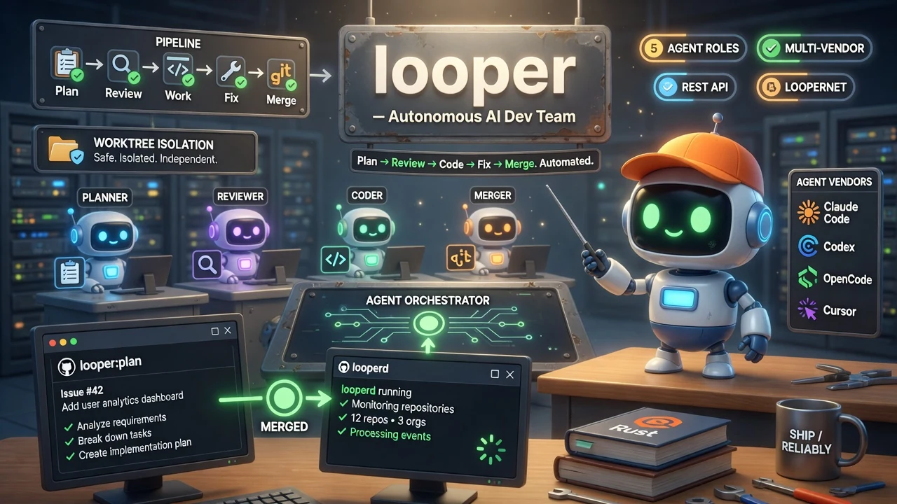

# looper — Autonomous AI Dev Team for Your GitHub Repos

<div align="center">
  
</div>

<div align="center">


</div>

**Autonomous AI Dev Team for Your GitHub Repos.**  
Monitor repos, plan features, write code, review PRs, and merge — all automated via 5 agent roles. Worktree isolation, multi-vendor support, REST API + daemon.

<div align="center">

```bash
curl -fsSL "https://github.com/quangdang46/looper_rust/releases/latest/download/install.sh" | bash
```

</div>

---

## 🤖 Agent Quickstart (Daemon Mode)

```bash
# Start the daemon
looper daemon start

# Add a project
looper projects add my-project --path /path/to/repo --repo-url owner/repo

# Label a GitHub issue `looper:plan` — the loop begins
```

**Daemon mode:** runs in background, polls GitHub for `looper:plan` issues, orchestrates Plan → Review → Work → Fix → Merge cycle automatically.

---

## TL;DR

**The Problem** — Feature implementation is a multi-turn loop: plan → review → work → fix → merge. Each turn requires context-switching, code writing, PR pushing, and CI babysitting. Human developers burn mental bandwidth on the loop instead of the architecture.

**The Solution** — `looper` monitors GitHub repositories, and when an issue is labeled `looper:plan`, it coordinates a team of AI agents to implement the feature end-to-end: planning, reviewing, fixing, and iterating until every check passes. Unlike CI/CD pipelines that only veto broken code, looper *writes* and *fixes* code.

**Why `looper` over manual feature implementation?**

| Dimension | Looper | Manual |
|---|---|---|
| Plan → Review → Work → Fix → Merge | Automated by 5 agent roles | Must hand-crank each turn |
| Agent vendors | Claude Code, Codex, OpenCode, Cursor, Custom | Single CLI |
| Multi-node coordination | loopernet cloud coordinator | — |
| Persistent daemon with REST API | `looperd` (background) | — |
| Worktree isolation | ✓ (via `git2`) | Manual |
| Price | Your agent subscription | Your hourly rate |

---

## Quick Example

```bash
# 1. Start the daemon
looper daemon start

# 2. Add a project with a resolvable GitHub repo
looper projects add my-project \
  --path /path/to/repo \
  --repo-url owner/repo \
  --default-branch main

# 3. Label a GitHub issue `looper:plan` — the loop begins
```

That's it. Looper handles the rest: issue detection, agent orchestration, PR creation, review iteration, and merge.

---

## Design Philosophy

| Principle | Rationale |
|---|---|
| **Disposable agent processes** | Each step (plan, review, work) invokes a fresh agent process. No long-running agent state to leak or corrupt. |
| **Configurable vendors** | Swap agent backends per run or globally — Claude Code, Codex CLI, OpenCode, Cursor CLI, or any custom binary. |
| **Git worktree isolation** | Looper never touches your primary checkout. All operations happen in disposable git worktrees. |
| **Tick-loop scheduler** | The daemon polls GitHub or receives webhooks. No polling delay on label events; configurable poll interval otherwise. |
| **SQLite persistence** | All state is in a local SQLite database. Stop and restart the daemon — interrupted runs resume cleanly. |

---

## Installation

```bash
# macOS / Linux — curl pipe
curl -fsSL "https://github.com/quangdang46/looper_rust/releases/latest/download/install.sh" | bash

# Windows PowerShell
irm "https://raw.githubusercontent.com/quangdang46/looper_rust/main/install.ps1" | iex

# From source
cargo build --release -p looperd -p looper-cli
cp target/release/looperd target/release/looper ~/.local/bin/
```

The installer detects your platform, fetches the matching binary from GitHub Releases, and atomically installs three binaries to `~/.local/bin/`:

| Binary | Role |
|---|---|
| `looper` | CLI client (talks to the daemon REST API on port 7391) |
| `looperd` | Daemon (long-running background process) |
| `loopernet` | Cloud coordination server (multi-node mode) |

---

## Quick Start

```bash
# Start daemon in the background
looper daemon start

# Health check
looper health

# Add a project
looper projects add my-project \
  --path /path/to/repo \
  --repo-url owner/repo \
  --default-branch main

# Label a GitHub issue with `looper:plan` — the pipeline fires
```

The daemon opens a REST API on `http://127.0.0.1:7391`. All CLI commands are REST calls.

---

## How It Works

### 1. Issue Detection

The daemon polls GitHub (or receives webhooks). When an issue is labeled `looper:plan`, a new loop begins.

### 2. Agent Loop

Looper runs a multi-agent workflow on every accepted issue:

```
┌─────────┐    ┌──────────┐    ┌────────┐    ┌────────────┐
│ Plan    │───▶│ Review   │───▶│ Work   │───▶│ Review     │
│ Agent   │    │ Agent    │    │ Agent  │    │ / Fix      │
└─────────┘    └──────────┘    └────────┘    └────────────┘
     │              │              │               │
     ▼              ▼              ▼               ▼
  Writes        Checks         Implements      Iterates
  a spec        the plan       the code        until green
```

Each step runs a **disposable agent process** — invoked, given context, captured, committed. If review fails, a fixer agent patches the PR and the loop repeats.

### 3. Agent Vendors

| Vendor | Identifier | Notes |
|---|---|---|
| Claude Code | `claude-code` | Anthropic's official CLI |
| Codex CLI | `codex` | OpenAI Codex CLI |
| OpenCode | `opencode` | Open-source agent CLI |
| Cursor CLI | `cursor` | Cursor editor CLI mode |
| Custom | `custom` | Any executable conforming to the agent protocol |

### 4. Priority Queues

| Queue | Type | Description |
|---|---|---|
| Auto | From config | Auto-discovered repos matched by label/author |
| Planned | `looper:plan` label | Issues explicitly tagged for Looper |
| Manual | CLI / API | Ad-hoc queue items via `looper queue enqueue` |

---

## Architecture

```
                    ┌──────────────────────┐
                    │     GitHub Issues     │
                    │  (labeled looper:plan)│
                    └──────────┬───────────┘
                               │ webhook / poll
                               ▼
┌─────────────────────────────────────────────────────┐
│                   looperd (daemon)                   │
│                                                      │
│  ┌──────────┐  ┌──────────┐  ┌──────────────────┐   │
│  │ Scheduler │─▶│  Runner  │──▶  Agent Executor  │   │
│  │ (tick)    │  │  (5 roles)│  │  (5 vendors)    │   │
│  └──────────┘  └──────────┘  └──────────────────┘   │
│         │            │                │              │
│         ▼            ▼                ▼              │
│  ┌──────────┐  ┌──────────┐  ┌──────────────────┐   │
│  │ Storage   │  │ Service  │  │ GitHub / Git     │   │
│  │ (SQLite)  │  │ (logic)  │  │ Gateway          │   │
│  └──────────┘  └──────────┘  └──────────────────┘   │
│         ▲                                            │
│  ┌──────┴──────┐                                     │
│  │  REST API   │  port 7391                          │
│  │  + SSE      │                                     │
│  └─────────────┘                                     │
└─────────────────────────────────────────────────────┘
         │                              │
         ▼                              ▼
┌─────────────────┐          ┌─────────────────────┐
│  looper (CLI)   │          │  loopernet (cloud)  │
│  health / projects│         │  multi-node coord.  │
│  loops / queue    │          │  claim routing      │
└─────────────────┘          └─────────────────────┘
```

---

## CLI Usage

The `looper` CLI is a REST client for `looperd` (default `http://127.0.0.1:7391`).

### Daemon lifecycle

```bash
looper daemon start              # start background daemon
looper daemon stop               # stop it
looper daemon status              # is it running?
looper daemon logs [N]            # tail recent logs
looper daemon install             # launchd / systemd
```

### Health & version

```bash
looper health
looper health --json
looper version
looper shutdown
```

### Projects

```bash
looper projects add myapp --path /path/to/checkout --repo-url owner/repo
looper projects list
looper projects get myapp
looper projects sync myapp
looper projects remove myapp
```

### Loops, runs, queue

```bash
looper loops list <project>
looper loops create <project> --type <type>
looper runs list <project> <seq>
looper runs start <project> <seq> --step <step>
looper queue enqueue <project> --type <type>
```

### Config

```bash
looper config get                        # daemon config
looper config-local set server.host 0.0.0.0
```

---

## Configuration

Looper uses a layered config system: embedded defaults → config file → environment → CLI overrides.

Search paths for `looper.toml` / `.yaml` / `.json`:

1. `$LOOPER_CONFIG/<file>`
2. `$XDG_CONFIG_HOME/looper/<file>`
3. `~/.config/looper/` (Linux) or `~/Library/Application Support/com.looper.looper/` (macOS)
4. `~/.looper/` (legacy)

### Minimal example

```toml
[server]
host = "127.0.0.1"
port = 7391

[daemon]
poll-interval-secs = 30

[agent]
vendor = "claude-code"
timeout-secs = 300
```

See [docs/configuration.md](docs/configuration.md) for the full reference.

---

## Troubleshooting

| Symptom | Likely Cause | Fix |
|---|---|---|
| `looper health` fails | Daemon not running | `looper daemon start` |
| Daemon won't start | Port 7391 in use | Check for another process; set `server.port` |
| Agent loop hangs | Timeout too low | Increase `agent.timeout-secs` |
| Worktree operations fail | Missing `gh` CLI | Install GitHub CLI and authenticate |
| Config warning on startup | File permissions too open | `chmod 600 ~/.looper/looper.toml` |

---

## FAQ

**Does Looper need API keys for every vendor?** No. You provide the agent binary (Claude Code, Codex CLI, etc.) with its own auth; Looper only invokes it.

**Can I run Looper on a single repo?** Yes — works on any number of repos. Configure which repos to watch.

**What happens if an agent hangs or crashes?** Agent processes have a configurable timeout (default 5 min per role). On timeout/crash, the run fails and the daemon logs the error. Normal operation continues.

**Is the SQLite database safe to delete?** Yes — it stores run history and queue state. Deleting it loses that history, but the daemon re-creates it on next start.

**Does Looper modify my local git state?** No — looper uses git worktrees (via `git2`) for all operations. Your primary checkout is never touched.
