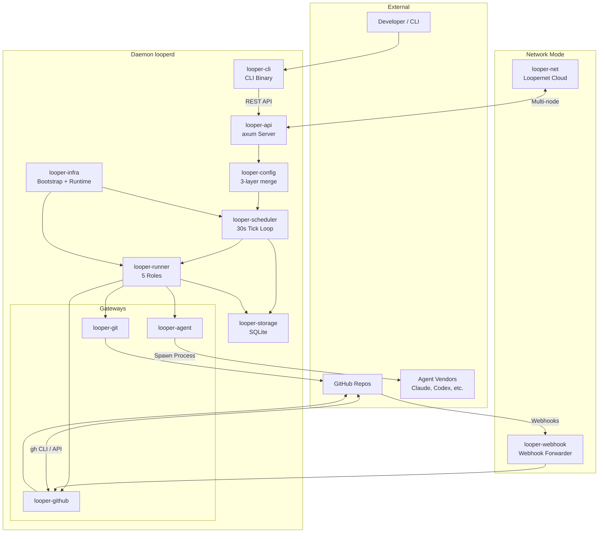
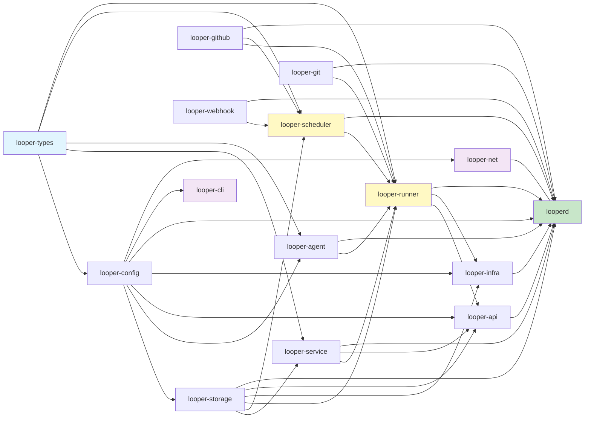
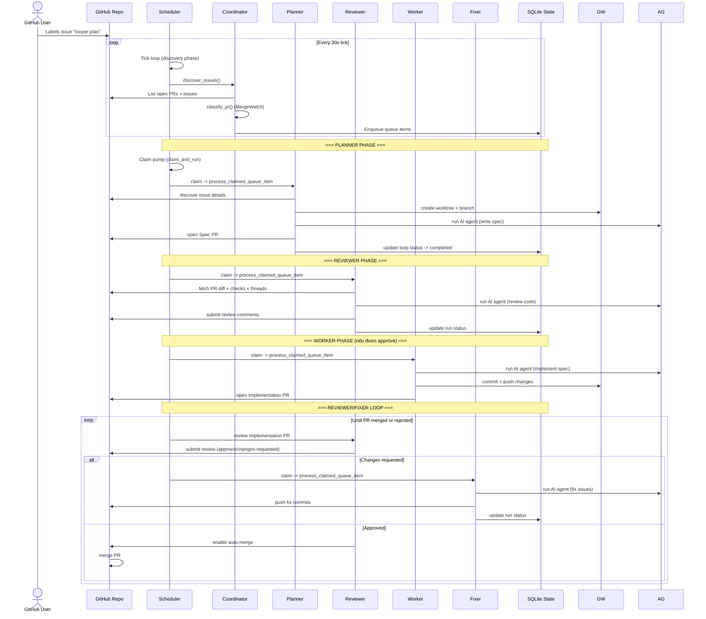
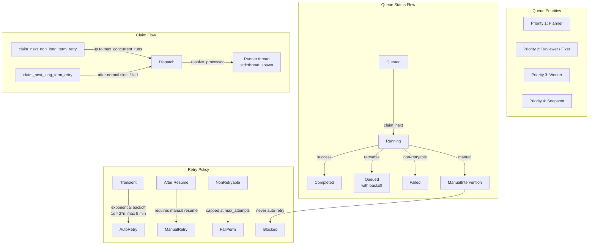
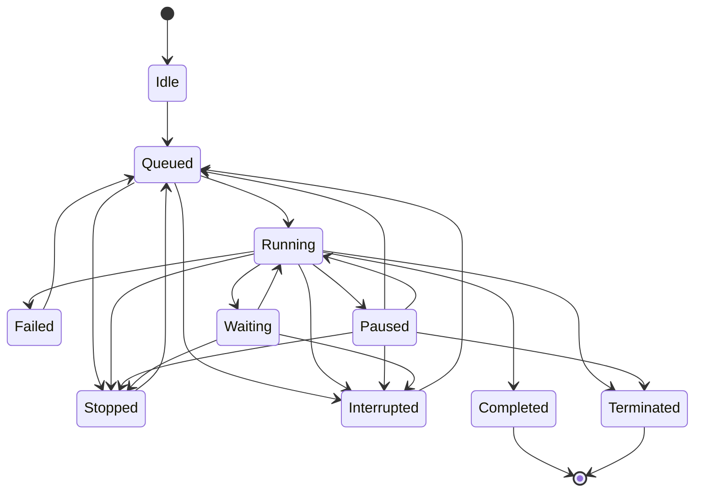
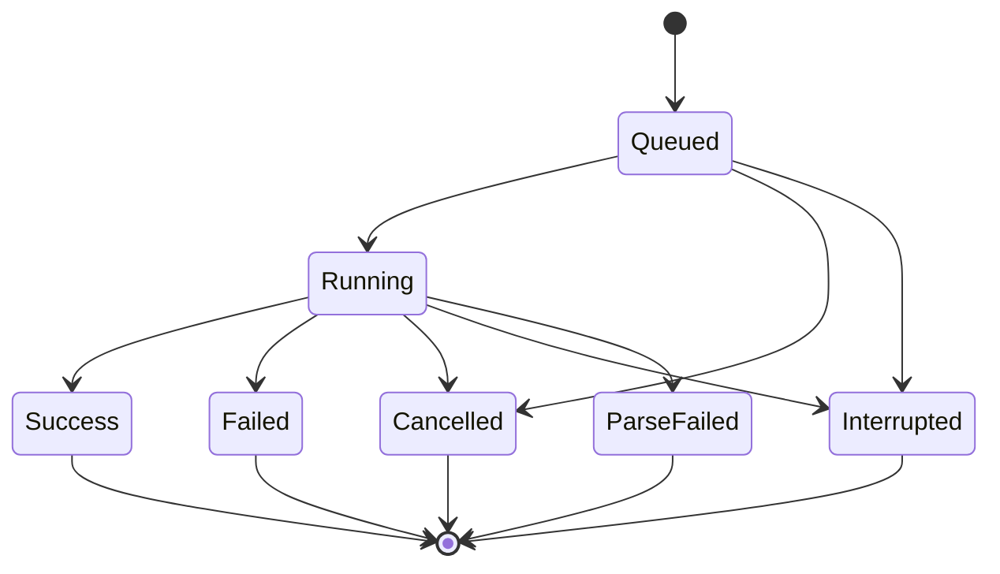
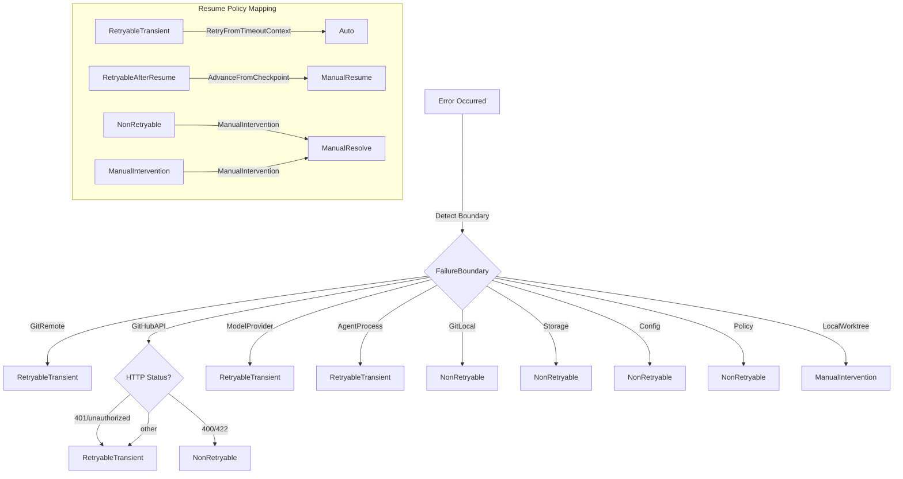
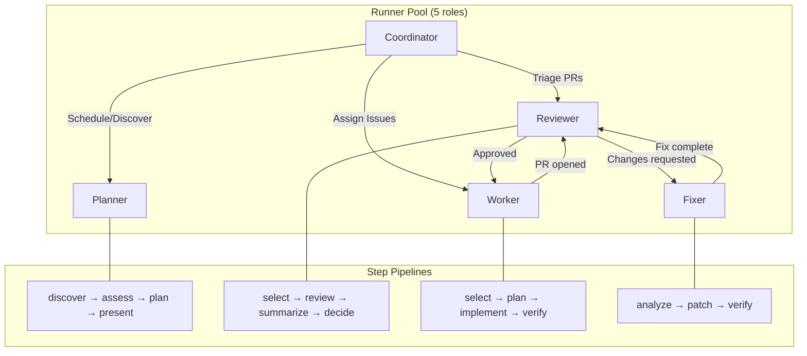

# Kiến trúc Looper Rust

> Autonomous AI Development Team cho GitHub Repositories.
> Port từ Go (~166K LOC) sang Rust (~37K LOC).

---

## 1. Tổng quan

Looper là một hệ thống daemon tự động hóa quy trình phát triển phần mềm trên GitHub. Nó hoạt động như một **đội ngũ AI phát triển tự động**: phát hiện issue, lập kế hoạch, review code, implement thay đổi, và fix lỗi -- tất cả đều tự động mà không cần can thiệp thủ công.

**Đặc điểm chính:**

| Đặc điểm | Mô tả |
|----------|-------|
| Nền tảng | Rust 2021 edition, Cargo workspace với 16 crates |
| Runtime | Tokio async runtime (daemon đơn luồng, đa nhiệm) |
| Lưu trữ | SQLite (rusqlite) với WAL mode, 17 migrations |
| Giao tiếp ngoài | REST API (axum), GitHub CLI (gh), Git (git2), Agent CLI |
| Agent AI | Hỗ trợ 5 vendors: Claude Code, Codex, OpenCode, Cursor CLI, Hermes |
| State machines | LoopStatus (10 states), RunStatus (7 states) |
| Xử lý lỗi | FailureBoundary với phân lớp retry (4 cấp độ) |

---

## 2. Kiến trúc tổng thể

### 2.1 System Architecture Overview



### 2.2 Cấu trúc Workspace

Workspace gồm 16 crates, chia thành 4 nhóm:

**Nhóm nền tảng (Foundation):**
| Crate | Loại | Mô tả |
|-------|------|-------|
| `looper-types` | lib | Domain enums, state machines, core types -- zero IO dependencies |
| `looper-config` | lib | Config loading, 3-layer merge (defaults -> file -> env/CLI) |
| `looper-storage` | lib | SQLite repositories, 12 repos, event log, migrations |
| `looper-service` | lib | Business logic: Loop/Run/Project lifecycle |

**Nhóm gateway (Leaf gateways):**
| Crate | Loại | Mô tả |
|-------|------|-------|
| `looper-github` | lib | GitHub gateway qua gh CLI + REST/GraphQL API |
| `looper-git` | lib | Git worktree management (tokio::process::Command) |
| `looper-agent` | lib | Agent executor (5 vendors, native resume, timeout) |

**Nhóm điều phối (Orchestration):**
| Crate | Loại | Mô tả |
|-------|------|-------|
| `looper-scheduler` | lib | Tick loop, queue claim, discovery orchestration |
| `looper-runner` | lib | 5 runner roles: Coordinator, Planner, Reviewer, Worker, Fixer |

**Nhóm giao diện (Interface):**
| Crate | Loại | Mô tả |
|-------|------|-------|
| `looper-api` | lib | axum REST server, auth, SSE, 30+ endpoints |
| `looper-webhook` | lib | Webhook forwarding, event routing, tunnel management |
| `looper-infra` | lib | Bootstrap, runtime lifecycle, notifications, worktree cleanup |
| `looperd` | bin | Daemon binary -- integration point |
| `looper-cli` | bin | CLI binary -- communicates với daemon qua REST API |
| `looper-net` | bin | Loopernet cloud server cho multi-node mode |
| `diffanchor` | lib | Diff parsing và anchor validation |

### 2.3 Daemon Bootstrap Sequence

```
1. Parse CLI args (clap)
2. Load config (3-layer merge)
3. Validate tool paths (git, gh)
4. Ensure runtime directories exist
5. Create logger (tracing)
6. Open SQLite, run migrations (refinery)
7. Initialize GitHub/git/agent gateways
8. Build HandlerMap với 5 runners
9. Create Scheduler (tick loop + claim pump)
10. Create DaemonRuntime (start + lifecycle)
11. Start API server (axum)
12. Complete startup (scheduler threads, recovery)
13. Wait for shutdown signal (SIGINT/SIGTERM)
14. Graceful shutdown
```

---

## 3. Dependency Graph



**Luồng dependency chính:**

```
looper-types (foundation)
  -> looper-config
    -> looper-storage
      -> looper-service
        -> looper-scheduler
          -> looper-runner
            -> looperd (daemon binary)

Leaf gateways (consumed bởi looper-runner):
  looper-github, looper-git, looper-agent

External-facing:
  looper-api, looper-webhook, looper-net, looper-cli
```

---

## 4. Data Flow

### 4.1 Từ Issue đến Merge



### 4.2 Queue Priority System



---

## 5. State Machines

### 5.1 LoopStatus -- Vòng đời của một Loop



**Phân loại trạng thái:**

| Nhóm | Trạng thái | Mô tả |
|------|-----------|-------|
| **Terminal** | `Completed`, `Failed`, `Terminated` | Kết thúc, không có transition ra |
| **Active running** | `Running`, `Paused`, `Waiting` | Đang thực thi, tối đa 1 active loop per target |
| **Non-active** | `Idle`, `Queued`, `Stopped`, `Interrupted` | Chưa chạy hoặc tạm dừng |

**One-active-loop invariant:** Tối đa một loop ở trạng thái **active-running** cho mỗi cặp `(loop_type, target_key)`.

### 5.2 RunStatus -- Vòng đời của một Run



### 5.3 Failure Classification



**Boundary Classification cho mỗi step:**

| Runner | Step | Boundary |
|--------|------|----------|
| Planner | discover-issues | GitHubAPI |
| Planner | prepare-worktree | GitRemote |
| Planner | write-spec | ModelProvider |
| Planner | publish | GitHubAPI |
| Reviewer | review-pr | GitHubAPI |
| Reviewer | check-worktree | GitLocal |
| Fixer | prepare-worktree | GitRemote |
| Worker | implement | AgentProcess |
| Worker | open-pr | GitHubAPI |

### 5.4 Resume Policies (6 loại)

| Policy | Hành vi | Auto-recover? |
|--------|---------|:---:|
| `AdvanceFromCheckpoint` | Tiếp tục từ checkpoint cuối | Khong |
| `ManualIntervention` | Chờ can thiệp thủ công | Khong |
| `ReplayStep` | Chạy lại step bị lỗi | Co |
| `RestartFromDiscover` | Khởi động lại từ discovery | Co |
| `RerunReview` | Chạy lại review (cho reviewer loops) | Co |
| `RetryFromTimeoutContext` | Retry với timeout context | Co |

### 5.5 Retry Policy (Exponential Backoff)

```rust
RetryPolicy {
    max_attempts: 5,
    base_delay: 1s,
    max_delay: 300s (5 phút),
    multiplier: 2.0,
    jitter: 0.5,  // +/- 50%
}
// delay = min(base * multiplier^attempt, max_delay) + jitter
```

---

## 6. Runner Roles và Step Pipelines

### 6.1 Các role trong Runner Pool



### 6.2 Lifecycle của một Loop/Run

```mermaid
sequenceDiagram
    participant Loop as Loop Record
    participant Run as Run Record
    participant Queue as Queue Item
    participant Runner as Runner Instance
    participant Agent as Agent Process

    Note over Loop,Agent: === CREATION ===
    Loop->>Loop: Status: Idle -> Queued
    
    Note over Loop,Agent: === SCHEDULER CLAIM ===
    Queue->>Queue: queued -> running
    Queue->>Runner: dispatch via claim_and_run
    
    Note over Loop,Agent: === RUN EXECUTION ===
    Runner->>Run: create run record (status: queued)
    Run->>Run: queued -> running
    Run->>Loop: Running
    
    loop Step pipeline
        Runner->>Run: record step progress
        Runner->>Agent: spawn agent process
        Agent->>Agent: execute task (timeout, parse, resume)
        Agent->>Runner: __LOOPER_RESULT__=...
        Runner->>Runner: parse completion output
    end
    
    Note over Loop,Agent: === COMPLETION ===
    Run->>Run: running -> success
    Run->>Run: record summary + artifacts
    
    alt Success
        Loop->>Loop: -> Completed
    else Failure (retryable)
        Loop->>Loop: -> Queued (with backoff delay)
        Queue->>Queue: attempts++, available_at = now + delay
    else Failure (non-retryable)
        Loop->>Loop: -> Failed
    else Manual intervention
        Loop->>Loop: -> Waiting
    end
```

---

## 7. Key Dependencies

| Dependency | Version | Mục đích |
|-----------|---------|----------|
| `tokio` | 1.x | Async runtime (full features) |
| `axum` | 0.8 | REST API server |
| `octocrab` | (qua gh CLI) | GitHub API interaction |
| `git2` | 0.20 | Git operations |
| `rusqlite` | 0.33 | SQLite database (bundled) |
| `refinery` | 0.9 | Database migrations |
| `clap` | 4.x | CLI argument parsing |
| `serde` / `serde_json` | 1.x | Serialization |
| `tracing` | 0.1 | Structured logging |
| `chrono` | 0.4 | Date/time handling |
| `uuid` | 1.x | UUID generation |
| `reqwest` | 0.12 | HTTP client (rustls-tls) |
| `tower-http` | 0.6 | HTTP middleware (CORS, trace) |
| `thiserror` | 2.x | Error type derivation |
| `anyhow` | 1.x | Error handling |

---

## 8. Module chi tiết

### 8.1 looper-types (Foundation)

Crate duy nhất không có IO dependencies. Định nghĩa toàn bộ domain types:

- `LoopStatus` (10 states) + state machine transitions
- `RunStatus` (7 states) + state machine transitions
- `LoopType` (4 variants: Planner, Reviewer, Worker, Fixer)
- `LoopTarget` / `LoopTargetType` (Project, PullRequest, Issue)
- `FailureKind` (4 classifications)
- `ResumePolicy` (6 policies)
- `RetryPolicy` (exponential backoff + jitter)
- `AgentVendor` (5 vendors + Custom)
- `AuthMode`, `DaemonMode`, `LogLevel`

### 8.2 looper-config (3-layer Merge Pipeline)

```
  defaults (embedded)
    -> file (YAML/TOML/JSON, auto-discover)
      -> environment variables (LOOPER_*)
        -> CLI overrides
```

Các module: `loader`, `types`, `partial`, `enums`, `validate`, `disclosure`, `env`, `defaults`, `permissions`.

### 8.3 looper-storage (SQLite Layer)

- **12 Repositories**: Projects, Loops, Runs, AgentExecutions, PullRequestSnapshots, Events, Locks, Queue, Notifications, Worktrees, WebhookForwarders, WebhookTunnelHooks
- **EventLog**: Audit trail với actor tracking và correlation IDs
- **Migrations**: Refinery-based, embedded SQL
- **Queue**: Priority queue với 3 blocking levels (terminal/paused loop, lock_key, reviewer-fixer dependency)

### 8.4 looper-scheduler (Tick Loop + Claim Pump)

```rust
Scheduler {
    tick_interval: 30s,
    max_concurrent_runs: 5,
    planer_discovery_enabled: true,
    coordinator_enabled: true,
    // ...
}
```

**Dual-thread architecture:**
1. **Main tick thread**: 30s interval, duyệt qua projects, chạy discovery cho từng runner
2. **Claim pump thread**: độc lập, claim + dispatch queue items ngay khi có slot trống

**Discovery pipeline per tick (theo thứ tự):**
1. PreDiscovery claim
2. Planner discovery
3. Coordinator discovery
4. Reviewer discovery
5. Fixer discovery
6. Worker discovery
7. PostDiscovery claim

### 8.5 looper-runner (5 Roles)

**Planner**: `discover-issues → prepare-worktree → write-spec → publish → notify`
**Reviewer**: `review-pr → check-worktree → submit-review → update-pr`
**Worker**: `process-issue → create-worktree → implement → commit-push → open-pr`
**Fixer**: `fix-pr → prepare-worktree → commit-fix → push-fix`
**Coordinator**: Tick-based PR classification (MergeWatch), triage queue items

### 8.6 looper-agent (Multi-Vendor Executor)

Hỗ trợ 5 vendors:
- Claude Code (native resume)
- Codex (native resume)
- OpenCode (native resume)
- Cursor CLI (native resume)
- Hermes (không native resume)

**Tính năng:**
- Per-vendor command resolution
- Native resume support (trừ Hermes)
- Two-tier timeout (max runtime + heartbeat/idle)
- SIGTERM -> SIGKILL signal escalation
- Completion marker parsing (`__LOOPER_RESULT__=`)
- Environment variable hardening (Git credential stripping)

### 8.7 looperd (Daemon Binary)

Main binary kết nối tất cả crate lại. Bootstrap sequence 14 bước như mục 2.3.

### 8.8 looper-cli (CLI Binary)

Giao tiếp với daemon qua REST API. Subcommands:
- `health`, `version`, `shutdown`, `reload`
- `projects` (add, remove, list, sync)
- `loops` (list, get, create, stop, close)
- `runs` (list, get, start)
- `queue` (list, stats)
- `events` (list, stream)
- `locks` (list, release)
- `config` (get, set)
- `daemon` (start, stop, restart, status, logs, install)
- `autoupgrade` (check, status, upgrade)

### 8.9 looper-net (Loopernet Cloud)

Multi-node coordination server. Cho phép nhiều looper daemon instances phối hợp làm việc.

---

## 9. Recovery Pipeline

Khi daemon khởi động, pipeline recovery chạy 5 phases:

```
1. Phase orphan cleanup
   - Tìm agent processes không còn parent
   - Kill orphans, ghi log cleanup
   
2. Phase expired lock release
   - Giải phóng lock hết hạn trong database

3. Phase stale run reconciliation
   - Phát hiện runs bị interrupted (daemon crash, unexpected shutdown)
   - Requeue queue items của interrupted runs
   - Cancel queue items của terminated loops

4. Phase cleanup stale queued items
   - Dọn queue items thuộc loop đã terminated

5. Phase health check
   - Verify worktrees còn hợp lệ
   - Kiểm tra các worktrees cũ (outdated)
```

---

## 10. Cấu trúc thư mục

```
looper_rust/
├── Cargo.toml                    # Workspace root
├── crates/
│   ├── looper-types/             # Domain types (zero IO)
│   ├── looper-config/            # Config loader
│   ├── looper-storage/           # SQLite + migrations
│   ├── looper-service/           # Business logic
│   ├── looper-github/            # GitHub gateway
│   ├── looper-git/               # Git worktree management
│   ├── looper-agent/             # AI agent executor
│   ├── looper-scheduler/         # Tick + claim loop
│   ├── looper-runner/            # 5 runner roles
│   ├── looper-api/               # REST API (axum)
│   ├── looper-webhook/           # Webhook forwarder
│   ├── looper-infra/             # Bootstrap + runtime
│   ├── looperd/                  # Daemon binary
│   ├── looper-cli/               # CLI binary
│   ├── looper-net/               # Multi-node server
│   └── diffanchor/               # Diff utilities
├── legacy/                       # Go reference (gitignored)
├── PORTING-TO-RUST/              # Design docs + specs
│   ├── LOOPER_RUST_DESIGN.md
│   └── specs/                    # Behavioral specs
└── .beads/                       # Task tracking
```
