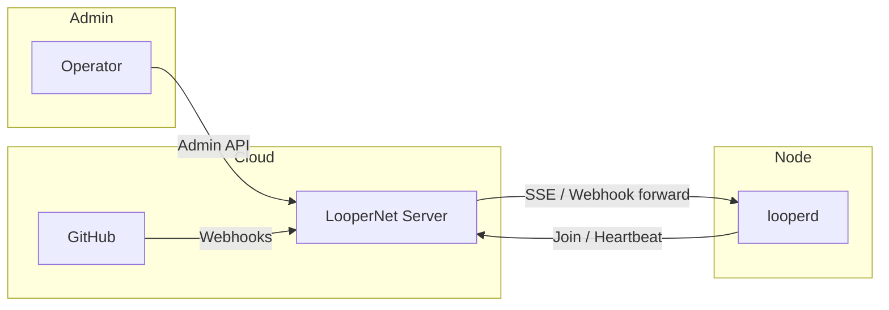

# Looper Network Mode

Multi-node Looper deployment orchestrated through a central cloud coordination server (LooperNet). This document covers the network topology, protocol, claim policies, peer discovery, state synchronization, and security model.

---

## Table of Contents

1. [Architecture Overview](#architecture-overview)
2. [Node Roles](#node-roles)
3. [Network Topology](#network-topology)
4. [Node Lifecycle](#node-lifecycle)
5. [Protocol](#protocol)
6. [Claim Policy](#claim-policy)
7. [Coordinator Lease (Leadership Election)](#coordinator-lease-leadership-election)
8. [Peer Discovery](#peer-discovery)
9. [State Synchronization](#state-synchronization)
10. [Target Labels](#target-labels)
11. [Identity Management](#identity-management)
12. [Security Considerations](#security-considerations)
13. [Configuration Reference](#configuration-reference)

---

## Architecture Overview

The Looper network adds a **cloud coordination layer** on top of the local daemon. Every `looperd` instance ("witness node") registers itself with a central LooperNet server. Work items -- pull request reviews, fixer tasks, worker loops -- can be routed to specific nodes via GitHub labels.

```
  +-------------+    +-------------+    +-------------+
  |  looperd A  |    |  looperd B  |    |  looperd C  |
  | (witness)   |    | (witness)   |    | (witness)   |
  +------+------+    +------+------+    +------+------+
         |                  |                  |
         |           HTTPS / WebSocket         |
         |                  |                  |
         +------------------+------------------+
                            |
                   +--------+--------+
                   |  LooperNet      |
                   |  Cloud Server   |
                   |  (loopernet)    |
                   +--------+--------+
                            |
                   +--------+--------+
                   |  GitHub         |
                   |  (webhooks,     |
                   |   PRs, labels)  |
                   +-----------------+
```

The LooperNet server is the single source of truth for membership, coordinator leases, and webhook event routing. Witness nodes do not communicate with each other directly -- all coordination passes through the server.

---

## Node Roles

### LooperNet Server (`loopernet`)

A standalone binary exposing an HTTP API for:

- Onboarding nodes via one-time join keys
- Accepting heartbeats and maintaining membership
- Managing the coordinator lease (distributed lock with fencing tokens)
- Forwarding GitHub webhook events to subscriber nodes
- Broadcasting audit events via Server-Sent Events (SSE)

### Witness Node (`looperd`)

Each `looperd` instance can serve multiple roles simultaneously, declared in its `NodeCapabilities`:

| Role | Capability field | Description |
|---|---|---|
| Worker | `roles: ["worker"]` | Executes PR work items (fixes, features) when targeted |
| Reviewer | `roles: ["reviewer"]` | Reviews PRs when targeted |
| Coordinator | `coordinator_eligible: true` | Eligible to hold the coordinator lease and perform tick-based PR discovery |

Capabilities are broadcast with every heartbeat and stored in the server database as a JSON blob.

### Daemon Modes (Config-Level)

A separate `DaemonMode` enum in `looper-types` controls deployment posture:

- **`Local`** (default) -- daemon runs in standalone mode, no network communication
- **`Cloud`** -- daemon registers with and receives work from the LooperNet server

The network mode is distinct from the daemon mode: a `Cloud` daemon participates in the network; a `Local` daemon does not.

---

## Network Topology

### Cluster Model

- A single LooperNet server hosts exactly one **network** (identified by `network_id`)
- All witness nodes registered with that server are members of the same network
- Each network has a `protocol_version` (currently `loopernet/v1`) enforced at join time
- An optional `minimum_daemon_version` gates which daemon versions can join

### Communication Model

- **Node-to-Server**: HTTPS only, bearer-token authenticated
- **Server-to-Node**: Server-Sent Events (SSE) for real-time audit events; webhook forwarding via HTTP POST
- **Node-to-Node**: None. All coordination is hub-and-spoke through the server

### Cloud Reachability

Each node's `NodeStatusResponse` carries a `cloud_reachable` boolean. The server also confirms reachability when processing webhook deliveries -- if a webhook arrives for an offline or unreachable node, it is logged but delivery is skipped.

---

## Node Lifecycle

### 1. Join Key Creation (Admin)

An administrator creates a one-time join key via the admin API:

```
POST /v1/join-keys
Authorization: Bearer <admin_token>
```

Response:
```json
{
  "ok": true,
  "data": { "joinKey": "join_<uuid>" }
}
```

Each key can be consumed exactly once. Keys are stored in the `join_keys` SQLite table with a `consumed_at` timestamp.

### 2. Node Join

A `looperd` instance joins the network by posting a join request (unauthenticated, key-authenticated):

```
POST /v1/join
{
  "protocolVersion": "loopernet/v1",
  "daemonVersion": "0.1.0",
  "joinKey": "join_<uuid>",
  "nodeName": "my-worker-1",
  "github": { "numericId": 12345, "login": "username" },
  "targetLabels": ["looper:target:my-worker-1"]
}
```

The server:

1. Validates the protocol version against the server's configured version
2. Checks `minimum_daemon_version` if configured
3. Validates the node name (1-32 chars, alphanumeric/dot/underscore/hyphen)
4. Atomically consumes the join key (fails if already consumed)
5. Attempts to reactivate an inactive node with the same name (rejoin with new credentials)
6. On name collision with an active node, rejects with `409 CONFLICT`
7. Generates a `node_id` and `node_token` (bearer token for subsequent calls)
8. Emits a `node.joined` audit event on the SSE stream
9. Persists the local state to `~/.looper/network.json` on the daemon side

Response:
```json
{
  "ok": true,
  "data": {
    "networkId": "my-network",
    "nodeId": "node_<uuid>",
    "nodeToken": "node_<token>",
    "warnings": []
  }
}
```

### 3. Heartbeat (Liveliness)

Every 10 seconds, joined nodes send a heartbeat:

```
POST /v1/heartbeat
Authorization: Bearer <node_token>
{
  "protocolVersion": "loopernet/v1",
  "daemonVersion": "0.1.0",
  "nodeName": "my-worker-1",
  "github": { "numericId": 12345, "login": "username" },
  "capabilities": { ... }
}
```

The server:

1. Validates the node token (lookup in `nodes` table)
2. Validates protocol version
3. Updates `last_heartbeat_at` and `capabilities_json` in the database
4. Checks for duplicate GitHub identities across all active nodes (generates warnings)
5. Detects identity drift (stored GitHub numeric ID or login changed) and adds warnings

### 4. Leave (Graceful Departure)

```
POST /v1/leave
Authorization: Bearer <node_token>
```

The server:

1. Marks the node as `active = 0` in the `nodes` table
2. If the leaving node held the coordinator lease, expires it
3. Emits a `node.left` audit event

### 5. Inactivity / Crashes

Nodes that stop sending heartbeats are not automatically evicted. The coordinator lease has a TTL (30 seconds by default) and expires if the holder stops renewing it. The daemon's `Manager` handles lease reconciliation on every heartbeat tick.

---

## Protocol

### Endpoint Summary

| Method | Path | Auth | Description |
|---|---|---|---|
| GET | `/healthz` | Admin | Health check |
| GET | `/status` | Admin | Full network status |
| POST | `/v1/join-keys` | Admin | Create a one-time join key |
| POST | `/v1/join` | Public | Register a new node |
| POST | `/v1/heartbeat` | Node | Liveliness ping |
| POST | `/v1/leave` | Node | Graceful departure |
| GET | `/v1/status` | Node | Node's own membership + full peer list |
| GET | `/v1/events` | Node | SSE audit event stream |
| POST | `/v1/coordinator-lease/acquire` | Node | Acquire coordinator lease |
| POST | `/v1/coordinator-lease/renew` | Node | Renew held lease |
| POST | `/v1/coordinator-lease/handoff` | Node | Transfer lease to another node |
| POST | `/v1/coordinator-lease/expire` | Node | Voluntarily expire held lease |
| POST | `/v1/coordinator-lease/revalidate` | Node | Probe external URL to confirm lease viability |
| GET | `/v1/github/webhook-secret` | Node | Get shared webhook HMAC secret |
| POST | `/v1/github/webhook` | Public | Receive forwarded GitHub webhook |

### API Response Envelope

All endpoints return a unified JSON envelope:

```json
// Success
{
  "ok": true,
  "data": { ... },
  "error": null
}

// Error
{
  "ok": false,
  "data": null,
  "error": { "message": "..." }
}
```

### Protocol Versioning

- Current version: `loopernet/v1`
- Enforced at join and on every heartbeat
- `NetConfig.protocol_version` is configurable at server startup
- Nodes sending a mismatched version are rejected

### Audit Events (SSE)

Nodes can subscribe to a real-time event stream at `/v1/events`. Events include:

| Event | Description |
|---|---|
| `node.joined` | A new node registered |
| `node.left` | A node left the network |
| `lease.acquired` | Coordinator lease was acquired |
| `lease.handoff` | Coordinator lease was transferred |
| `lease.expired` | Coordinator lease was expired |
| `webhook.received` | A GitHub webhook was delivered |

The SSE stream uses `tokio::sync::broadcast` with a buffer of 256 events. Fast consumers receive every event; slow consumers may lag.

---

## Claim Policy

The claim policy determines whether a witness node should take ownership of a PR work item.

### Network Mode (Per-Project)

Each project can be in one of two modes, defined in `looper-net`'s `NetworkMode` enum:

| Mode | Behavior |
|---|---|
| `Off` | Local execution only. No routing labels checked. The local node always claims the work. |
| `Routed` | Distributed routing. Claims are gated by GitHub labels and identity matching. |

### Worker Claim Evaluation

A node attempts to claim a worker role on a PR via `evaluate_worker` in the `policy` module:

1. **If mode is `Off`**: Immediately allowed (local mode)
2. **If mode is `Routed`**:
   - The PR must have the label `looper:worker-ready`
   - The PR must have **exactly one** `looper:target:<node_name>` label matching the local node
   - The local node's GitHub identity must appear in the PR assignees list

### Reviewer Claim Evaluation

A node attempts to claim a reviewer role via `evaluate_reviewer`:

1. **If mode is `Off`**: Immediately allowed (local mode)
2. **If mode is `Routed`**:
   - The PR must have **exactly one** `looper:target:<node_name>` label matching the local node
   - The local node's GitHub identity must appear in the PR review request list

### Identity Matching Priority

When checking GitHub identity in either assignees or review requests:

1. **Numeric match** (highest priority): Both stored and remote `numeric_id` are non-zero and equal
2. **Login fallback**: Case-insensitive login string comparison

Returns a `MatchMode` enum: `None`, `Numeric`, or `LoginFallback`.

### Target Label Adjustment

The helper `labels_need_target_adjustment` determines whether a PR's labels need updating before a node can claim work on it. Labels are managed as GitHub PR labels with the `looper:target:<name>` format.

---

## Coordinator Lease (Leadership Election)

### Purpose

Exactly one node in the network holds the coordinator lease at any time. The coordinator is responsible for:

- Running tick-based PR discovery (`discover_issues`)
- Classifying PRs via MergeWatch
- Enqueuing queue items (reviewer, fixer, worker tasks) for the scheduler

### Mechanism

The lease is a row in the `coordinator_leases` SQLite table with:

- `name`: always `"coordinator"`
- `holder_node_id`: the winning node's ID (nullable)
- `fencing_token`: monotonically increasing integer, guarantees lease freshness
- `expires_at`: ISO 8601 timestamp; lease is vacant if this is `NULL` or in the past

### Operations

| Operation | Description |
|---|---|
| **Acquire** | Atomically sets holder and increments fencing token. Rejected with `409 CONFLICT` if current holder still holds a valid (non-expired) lease. |
| **Renew** | Extends `expires_at` by `lease_ttl_seconds`. Requires correct holder + fencing token; returns `412` on stale token. |
| **Handoff** | Transfers lease from current holder to `target_node_id`. Requires correct fencing token. |
| **Expire** | Sets `holder_node_id = NULL` and `expires_at = NULL`. Requires correct fencing token. |
| **Revalidate** | Probes an external URL, sending the fencing token as `X-Looper-Coordinator-Fencing-Token` header. Used to verify the holder is still actively coordinating. |

### Lease Reconciliation (Daemon-Side)

The daemon's `Manager` runs lease reconciliation on every heartbeat tick:

1. Checks eligibility: must be `coordinator_eligible`, have routed projects, no identity drift, and a valid GitHub numeric ID
2. **If holds lease and still eligible**: renews it
3. **If lease vacant and eligible**: acquires it
4. **If holds lease but no longer eligible**: expires it voluntarily

### Default TTL

- 30 seconds (configurable via `LOOPERNET_LEASE_TTL_SECONDS`)
- Heartbeat interval: 10 seconds (renewals happen every heartbeat)
- Three missed heartbeats before the lease expires naturally

---

## Peer Discovery

### Membership List

Every authenticated status request (`GET /v1/status`) returns the full list of active peers:

```json
{
  "networkId": "...",
  "membership": { /* caller's own record */ },
  "memberships": [
    {
      "nodeId": "node_...",
      "nodeName": "worker-alpha",
      "daemonVersion": "0.1.0",
      "github": { "numericId": 12345, "login": "alice" },
      "capabilities": { ... },
      "targetLabels": ["looper:target:worker-alpha"],
      "joinedAt": "...",
      "lastHeartbeatAt": "...",
      "duplicateGithubIdentityWarning": false
    }
  ],
  "lease": { /* current coordinator lease, if any */ },
  "warnings": []
}
```

### SSE Event Stream

Nodes can subscribe to `/v1/events` for real-time notifications of:

- Peer joins and leaves
- Lease changes
- Webhook deliveries

### Leader Election Visibility

Any node can see who currently holds the coordinator lease through the status response. The fencing token provides an ordering guarantee -- if a node sees fencing token N, it knows any lease with token < N is stale.

---

## State Synchronization

### What Gets Synced

| Data | Source of Truth | Sync Mechanism | Frequency |
|---|---|---|---|
| Node membership | LooperNet DB | Heartbeat | 10s |
| Node capabilities | Node (self-declared) | Heartbeat payload | 10s |
| Coordinator lease | LooperNet DB | Acquire/renew/handoff | On change |
| Target labels | GitHub PR labels | GitHub API via coordinator tick | Per tick |
| GitHub identities | Node (self-declared) | Join + Heartbeat | On join + 10s |
| Webhook events | GitHub | Webhook forwarding | On event |

### Capabilities

Each node publishes its capabilities on every heartbeat:

```json
{
  "roles": ["coordinator", "worker", "reviewer"],
  "coordinatorEligible": true,
  "routedProjects": 3,
  "routedProjectIds": ["proj-alpha", "proj-beta", "proj-gamma"],
  "reviewerProjects": [{"projectId": "...", "includeDrafts": false, ...}],
  "localProjects": 5,
  "dynamicLoad": 0,
  "identityDrift": false,
  "driftReason": ""
}
```

The `dynamicLoad` field is reserved for future load-aware scheduling.

### Identity Drift Detection

The server detects identity drift by comparing the GitHub identity sent with each heartbeat against the identity stored at join time:

- **Numeric ID change**: GitHub user ID changed (accounts merged, token changed)
- **Login change**: GitHub username changed (case-insensitive comparison)

Identity drift does not block heartbeats but surfaces as a warning on the status endpoint. Nodes with active identity drift are **ineligible** for the coordinator lease.

### Persisted Local State

After joining, the daemon persists a `network.json` to `~/.looper/network.json`:

```json
{
  "url": "https://loopernet.example.com",
  "networkId": "my-network",
  "nodeId": "node_<uuid>",
  "nodeName": "my-worker-1",
  "nodeToken": "node_<token>",
  "github": { "numericId": 12345, "login": "username" }
}
```

This file is created with `0600` permissions via an atomic write (tmp file + rename). It is removed when the node leaves the network.

---

## Target Labels

Target labels are GitHub PR labels of the form `looper:target:<node_name>`. They route work to specific nodes.

### Label Management

| Helper Function | Purpose |
|---|---|
| `parse_target_label` | Extract node name from `looper:target:<name>` |
| `target_label_for_node` | Build `looper:target:<node_name>` from a name |
| `collect_target_labels` | Filter a label list to only `looper:target:*` labels |
| `has_exact_target` | Check if labels contain exactly one target matching a node |
| `plan_exact_target` | Modify a label list to have exactly one target for a given node |

### Worker-Ready Label

For worker routing, PRs must additionally carry the label `looper:worker-ready`. This is a two-phase gating mechanism:

1. Reviewer assigns the PR with `looper:target:<worker_name>`
2. Reviewer adds `looper:worker-ready` when the PR is ready for execution

### Example Label Combinations

| Labels | Interpretation |
|---|---|
| `looper:target:node-alpha`, `looper:worker-ready`, `bug` | PR targeted at `node-alpha` for worker execution |
| `looper:target:node-beta` | PR targeted at `node-beta` for review only |
| `bug`, `enhancement` | Untargeted PR (local mode only) |

---

## Identity Management

### GitHub Identity

Every node authenticates its operator via a GitHub identity:

```rust
struct GitHubIdentity {
    numeric_id: i64,  // GitHub user database ID
    login: String,    // GitHub username
}
```

The `numeric_id` is preferred for matching because it is immutable. Login fallback handles cases where the user does not have a numeric ID configured (e.g., a personal access token without user ID scope).

### Duplicate Detection

The server periodically checks for duplicate GitHub identities across all active nodes via `get_duplicate_github_ids`. If two nodes claim the same GitHub identity, a warning is attached to each affected node's membership record and returned in status responses.

This prevents:

- A single GitHub user from operating multiple witness nodes under the same identity
- Identity confusion when the same person runs both a laptop daemon and a CI daemon

---

## Security Considerations

### Network Boundaries



### Authentication Layers

| Layer | Mechanism | Scope |
|---|---|---|
| Admin API | Bearer token (`admin_token`) | All admin endpoints |
| Node API | Bearer token (`node_token`) | Per-node authenticated endpoints |
| Join | One-time key | Single-use registration |
| Webhook forwarding | HMAC secret (`webhook_secret`) | Webhook delivery verification |

The `admin_token` is a static string configured at server startup via `LOOPERNET_ADMIN_TOKEN`. The `node_token` is generated per-node at join time and stored in `~/.looper/network.json` with `0600` permissions.

### Join Key Security

- Join keys are UUID-based, single-use
- Consumed atomically via SQLite `UPDATE ... WHERE consumed_at IS NULL`
- Once consumed, a key cannot be reused (replay protection)
- Keys are created by an authorized administrator only

### Transport Security

- All communication is over HTTPS (the server listens on a configurable address, default `127.0.0.1:8089`)
- TLS is not implemented in the server itself -- it relies on a reverse proxy (nginx, Caddy) for TLS termination
- The server supports an `advertise_url` for webhook forwarding that should point to the public HTTPS endpoint

### Rate Limiting and Resource Protection

- The SSE channel has a fixed buffer of 256 events; slow consumers will lag rather than block the server
- Database operations use WAL mode for concurrent reads during writes
- Heartbeat processing is lightweight -- no heavy computation is performed per tick

### Version Gating

- Protocol version mismatch rejects the request at the handler level
- Minimum daemon version prevents outdated nodes from joining the network
- Version comparison uses a simple semver parser that strips pre-release and build metadata suffixes

### Threat Model

| Threat | Mitigation |
|---|---|
| Stolen join key | Single-use; cannot be replayed |
| Stolen node token | Stored at `0600`; token rotated on rejoin |
| Rogue node claiming same identity | Duplicate GitHub identity detection |
| Rogue node impersonating coordinator | Fencing token gating on lease operations |
| Old/insecure daemon joining | Minimum daemon version check |
| Replay of stale lease operations | Fencing token monotonically increases; stale token = 412 |

---

## Configuration Reference

### LooperNet Server (`loopernet`)

| Flag | Env Var | Default | Description |
|---|---|---|---|
| `--listen-addr` | `LOOPERNET_LISTEN_ADDR` | `127.0.0.1:8089` | HTTP listen address |
| `--db-path` | `LOOPERNET_DB_PATH` | (required) | Path to SQLite database |
| `--admin-token` | `LOOPERNET_ADMIN_TOKEN` | (required) | Bearer token for admin API |
| `--network-id` | `LOOPERNET_NETWORK_ID` | `""` | Human-readable network name |
| `--protocol-version` | `LOOPERNET_PROTOCOL_VERSION` | `loopernet/v1` | Expected protocol version |
| `--minimum-daemon-version` | `LOOPERNET_MIN_DAEMON_VERSION` | None | Minimum daemon version for joining |
| `--lease-ttl-seconds` | `LOOPERNET_LEASE_TTL_SECONDS` | `30` | Coordinator lease TTL |
| `--advertise-url` | `LOOPERNET_ADVERTISE_URL` | None | Public URL for webhook forwarding |

### Host Configuration (Reverse Proxy)

Recommended Nginx snippet:

```nginx
server {
    listen 443 ssl;
    server_name loopernet.example.com;

    ssl_certificate     /etc/letsencrypt/live/loopernet.example.com/fullchain.pem;
    ssl_certificate_key /etc/letsencrypt/live/loopernet.example.com/privkey.pem;

    location / {
        proxy_pass http://127.0.0.1:8089;
        proxy_http_version 1.1;
        proxy_set_header Upgrade $http_upgrade;
        proxy_set_header Connection "upgrade";
        proxy_set_header Host $host;
        proxy_set_header X-Forwarded-For $proxy_add_x_forwarded_for;
        proxy_read_timeout 86400s;
    }
}
```

### Daemon Configuration (`looperd`)

Network participation is enabled via the `looper-config` system. The daemon mode (`DaemonMode`) defaults to `Local`; set to `Cloud` for network mode. There is currently no primary-surface `looper network *` CLI — configure cloud join via daemon config / loopernet ops, not a Go-era network subcommand.

### Database Schema

The LooperNet server uses SQLite with WAL mode:

```sql
CREATE TABLE meta (
    key TEXT PRIMARY KEY,
    value TEXT NOT NULL
);

CREATE TABLE join_keys (
    join_key TEXT PRIMARY KEY,
    created_at TEXT NOT NULL,
    consumed_at TEXT,
    consumed_by_node_id TEXT
);

CREATE TABLE nodes (
    node_id TEXT PRIMARY KEY,
    node_name TEXT NOT NULL UNIQUE COLLATE NOCASE,
    node_token TEXT NOT NULL UNIQUE,
    daemon_version TEXT NOT NULL,
    github_numeric_id INTEGER NOT NULL,
    github_login TEXT NOT NULL,
    target_labels TEXT NOT NULL,
    capabilities_json TEXT NOT NULL DEFAULT '{}',
    joined_at TEXT NOT NULL,
    last_heartbeat_at TEXT,
    active INTEGER NOT NULL DEFAULT 1
);

CREATE TABLE coordinator_leases (
    name TEXT PRIMARY KEY,
    holder_node_id TEXT,
    fencing_token INTEGER NOT NULL,
    expires_at TEXT
);
```

The database is automatically created and migrated on server startup. All timestamps are ISO 8601 with nanosecond precision and Z suffix.
